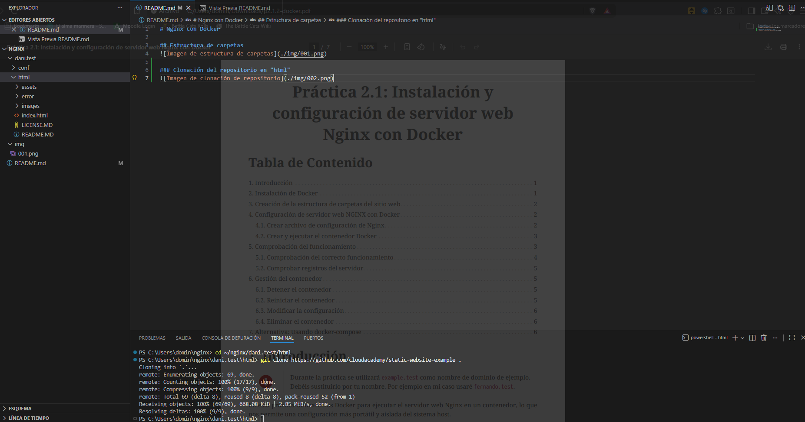
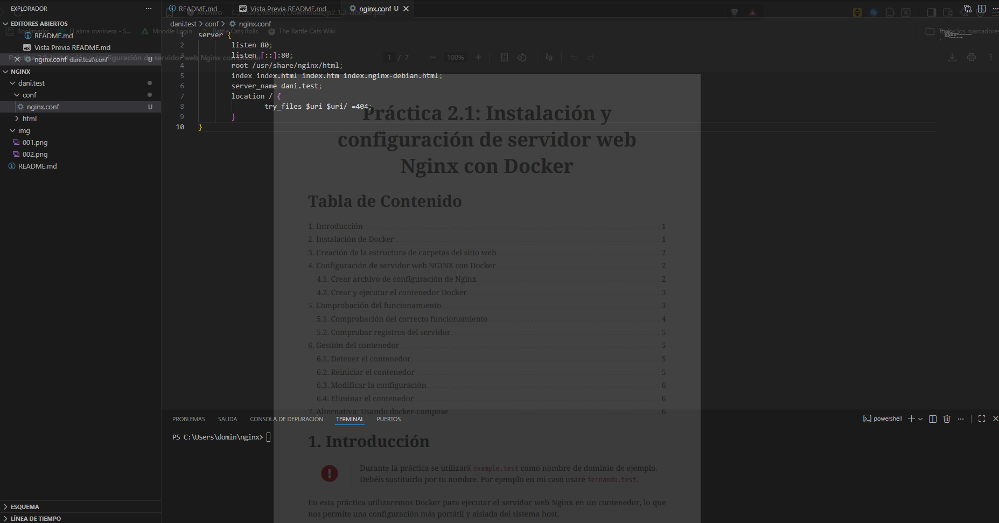
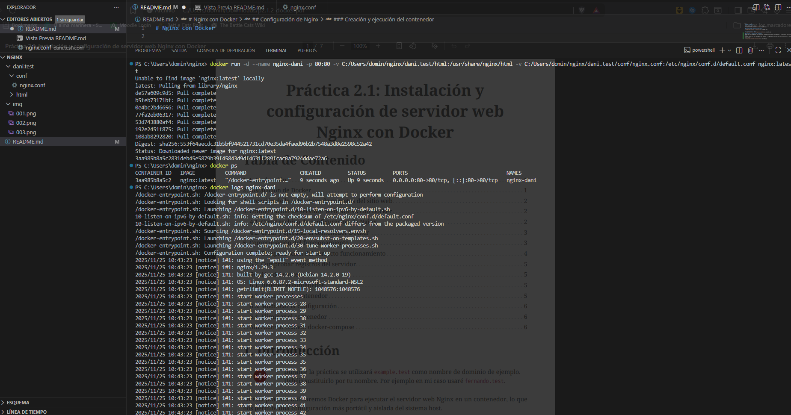
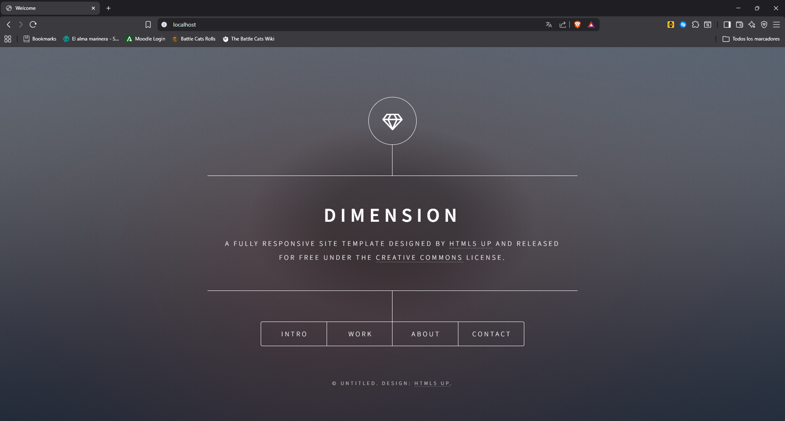
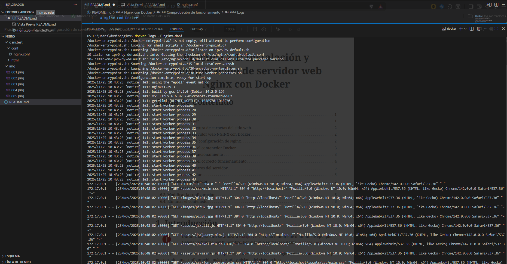
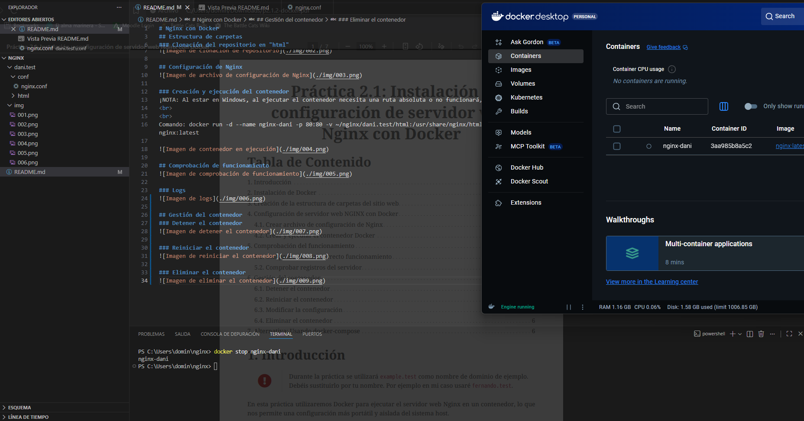

# Nginx con Docker

## Estructura de carpetas

### Clonación del repositorio en "html"

## Configuración de Nginx

### Creación y ejecución del contenedor
¡NOTA: Al estar en Windows, al ejecutar el contenedor necesita una ruta absoluta o no funcionará, se necesita cambiar "~" por "C:/Users/[usuario]"!
 
 
Comando: docker run -d --name nginx-dani -p 80:80 -v ~/nginx/dani.test/html:/usr/share/nginx/html -v ~/nginx/dani.test/conf/nginx.conf:/etc/nginx/conf.d/default.conf nginx:latest

## Comprobación de funcionamiento

### Logs

## Gestión del contenedor
### Detener el contenedor

### Reiniciar el contenedor

### Eliminar el contenedor
